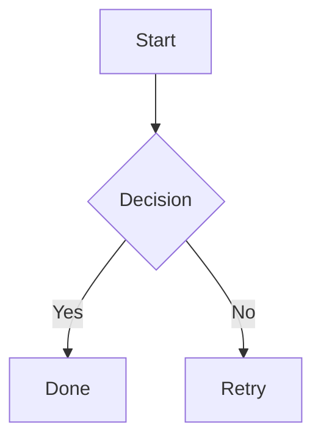

# make-md

A Typora-style desktop Markdown editor built with Tauri, Vue 3, and ProseMirror.

## Features

- **Typora-style editing** — block shortcuts (`#`, `-`, `>`, `` ``` ``), inline **bold** / *italic* / `code` / links / images
- **Rich blocks** — task lists, tables, blockquotes, horizontal rules, **Mermaid** diagrams
- **File workflow** — open/save/save-as, multi-tab, recent files, unsaved prompts
- **Reliability** — autosave and crash recovery (Rust-backed snapshots)
- **Productivity** — command palette (⌘⇧P), focus mode (F8), light/dark theme
- **Export** — standalone HTML with Mermaid rendering (⌘E)

## Development

```bash
pnpm install
pnpm tauri dev
```

## Keyboard Shortcuts

| Shortcut | Action |
|----------|--------|
| ⌘N | New file |
| ⌘O | Open file |
| ⌘S | Save |
| ⌘⇧S | Save as |
| ⌘E | Export HTML |
| ⌘⇧P | Command palette |
| ⌘⇧L | Toggle theme |
| ⌘\\ | Toggle sidebar |
| F8 | Focus mode |

## Mermaid Example

````markdown

````

## Testing

```bash
pnpm test
```

## Build

```bash
pnpm tauri build
```
