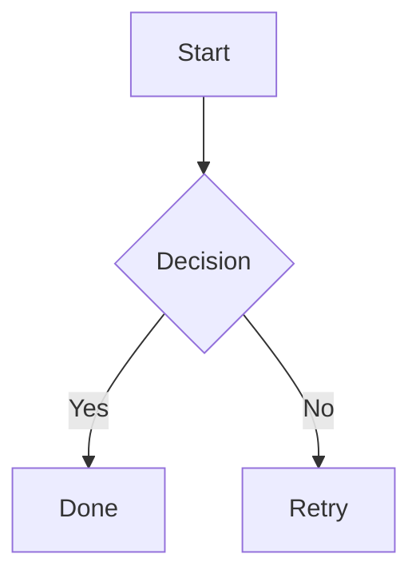

# make-md

A Typora-style desktop Markdown editor built with Tauri, Vue 3, and ProseMirror.

## Features

- **Typora-style editing** — block shortcuts (`#`, `-`, `>`, `` ``` ``), inline **bold** / *italic* / `code` / links / images
- **Rich blocks** — task lists, tables, blockquotes, horizontal rules, **Mermaid** diagrams
- **Folder workspace** — open a folder (⌘⇧O), browse `.md` files in a tree, create/rename/delete/move files
- **Outline** — Files | Outline sidebar tabs; click headings to navigate
- **Find & replace** — in-document search (⌘F) and replace (⌘⌥F)
- **Images** — paste or drop images into `./assets/` next to the saved document
- **File workflow** — open/save/save-as, multi-tab, recent files, unsaved prompts
- **Reliability** — autosave and crash recovery (Rust-backed snapshots)
- **Productivity** — command palette (⌘⇧P), focus mode (F8), light/dark theme
- **Export** — standalone HTML (⌘E) and PDF (⌘⇧E, macOS with Chrome/Chromium/Edge)

## Development

```bash
pnpm install
pnpm tauri dev
```

## Keyboard Shortcuts

| Shortcut | Action |
|----------|--------|
| ⌘N | New file |
| ⌘O | Open file |
| ⌘⇧O | Open folder |
| ⌘S | Save |
| ⌘⇧S | Save as |
| ⌘E | Export HTML |
| ⌘⇧E | Export PDF |
| ⌘F | Find in document |
| ⌘⌥F | Replace in document |
| ⌘⇧P | Command palette |
| ⌘⇧L | Toggle theme |
| ⌘\\ | Toggle sidebar |
| F8 | Focus mode |

## Mermaid Example

````markdown

````

## Testing

```bash
pnpm test
pnpm test:e2e
```

## Build

```bash
pnpm tauri build
```
